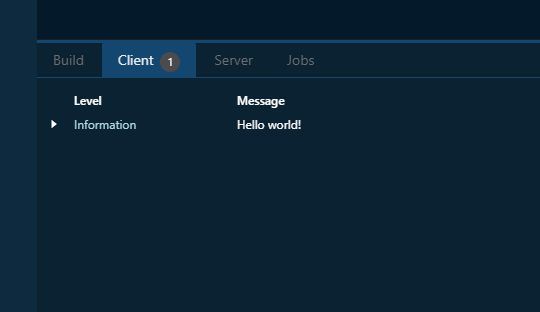

# Basic Syntax

From this document, you'll learn the basics of the Spheroid Script. You can run the examples by creating 
a simple [Hello World](../examples/HelloWorld/README.md) app and replacing its code with the code from the examples.

Try it out!

If you have encountered any problems, please let us know by 
[submitting an issue](./submit-an-issue.md), we will make sure to help you find the solution.

## Application entry point

An entry point of an application is the `main` function.

```
fun main() {
    println("Hello world!")
}
```

Running this example produces the following output in the Spheroid Demiurge IDE: 



## Functions

Function that takes two parameters and returns a value:

```
fun sum(a, b) {
    return a + b
}

fun main() {
    println("Sum of 4 and 7 is ${sum(4, 7)}.")
}
```

Function returning no value:

```
fun printSum(a, b) {
    println("Sum of $a and $b is ${a + b}.")
}

fun main() {
    printSum(10, 20)
}
```

## Variables

Read-only local variables are defined using the keyword `val`. They can be assigned a value only once.

```
fun main() {
    val a = 1
    println("a = $a")
}
```

Variables that can be reassigned use the `var` keyword:

```
fun main() {
    var x = 5
    x = x + 1
    println("x = $x")
}
```

Top-level variables:

```
val a = "Foo"
var b = 0

fun incrementB() { 
    b = b + 1 
}

fun main() {
    println("a = $a; b = $b")
    incrementB()
    println("incrementB()")
    println("a = $a; b = $b")
}
```

## Comments

Spheroid Script supports single-line (or _end-of-line_) and multi-line (_block_) comments.

```
// This is an end-of-line comment

/* This is a block comment
   on multiple lines. */
```

## String templates

String literals may contain template expressions, i.e. pieces of code that are evaluated and whose results are concatenated into the string. A template expression starts with a dollar sign ($) and consists of either a simple name:

```
fun main() {
    val i = 10
    println("i = $i") // prints "i = 10"
}
```

or an arbitrary expression in curly braces:

```
fun main() {
    val i = 10
    println("i * 3 = ${i * 3}") // prints "i * 3 = 30"
}
```

## Conditional expressions

```
fun maxOf(a, b) {
    if (a > b) {
        return a
    } else {
        return b
    }
}

fun main() {
    println("max of 0 and 42 is ${maxOf(0, 42)}")
}
```

`if` can also be used as an expression:

```
fun maxOf(a, b) {
    return if (a > b) a else b
}

fun main() {
    println("max of 0 and 42 is ${maxOf(0, 42)}")
}
```

## `for` loop

```
fun main() {
    val items = listOf("1st item", "2nd item", "3rd item")
    for (item in items) {
        println(item)
    }
}
```

## Ranges

Iterating over a range:

```
fun main() {
    for (x in 1..5) {
        println(x)
    }
}
```

## Collections

Iterating over a collection:

```
fun main() {
    val items = listOf("1st item", "2nd item", "3rd item")
    for (item in items) {
        println(item)
    }
}
```

## Other tutorials and documentation

* [Hello World](../examples/HelloWorld/README.md)
* [Create a simple geo-based AR game](../examples/CoinQuest/README.md)
* [Spheroid Script reference](https://spheroiduniverse.github.io/SpheroidScript/)