# Quickstart of UI Demo App

This tutorial will take you through the steps to create and launch on your mobile phone 
the app powered by the Spheroid Universe Platform
and demonstrating the possibilities of the Spheroid UI Engine.

## Create an account in the Spheroid Universe Platform

Before you create your app, you need to 
[create an account](https://spheroiduniverse.io/marketplace/register) 
in the Spheroid Universe Platform.

If you already have an account in the Spheroid Universe Platform, you can skip this step.

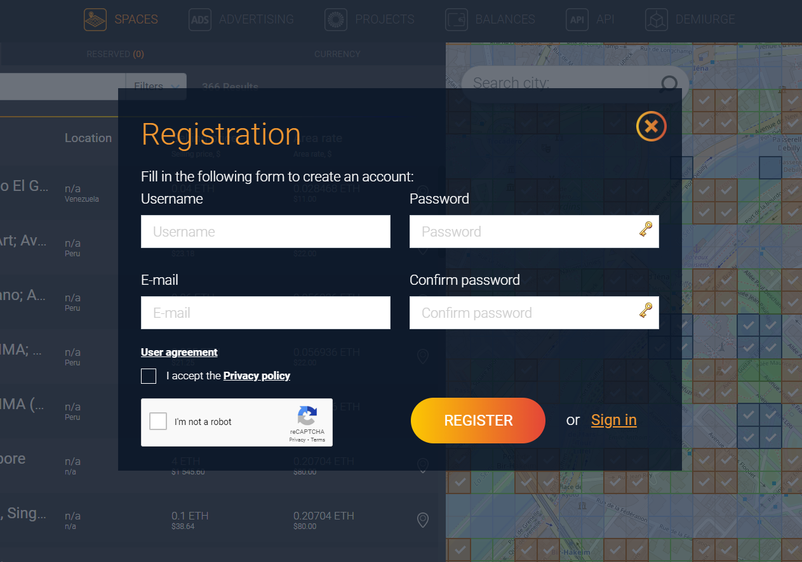

## Log in to the Spheroid Demiurge IDE

Now you have the access to all Platform services, including the Spheroid Demiurge IDE. 

Log in to the [Spheroid Demiurge IDE](https://demiurge.spheroiduniverse.io/ide), 
using the same email and password you used to register in the Platform.

## Create your app

Open the "Apps" tab and click the "Create" button. 

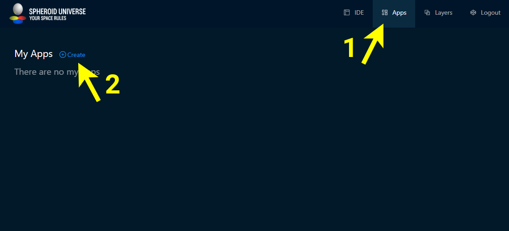

Enter the app name, leave the check on the "Create a layer corresponding to this app" box 
and click the "Create App" button. 
The app will be created along with the layer you will later use to publish the app into.


If the app doesn't get immediately created, and you get the error 
"Can't create an app because the app with the name 'xxx' already exists", 
it means the name you've chosen is already taken, so try another one.


## Download the source code

We have already prepared for you the source code you'll need to create a demo app. 
Download a zip archive from [our repo](https://github.com/SpheroidUniverse/SpheroidScript).

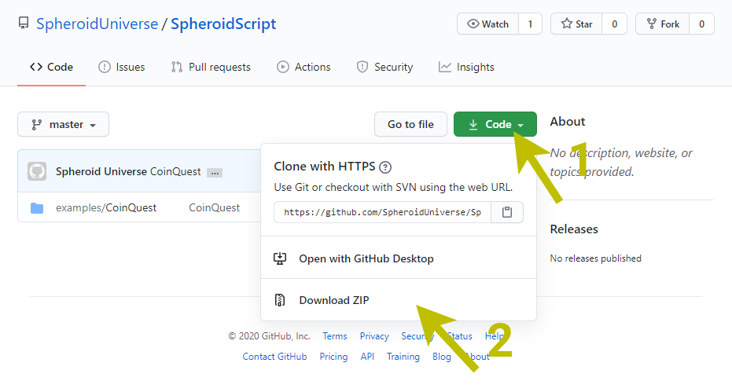

Then extract contents of the 'SpheroidScript-master\examples\UI\src' folder from the zip archive.
You're now all set to upload the source code to your app!

## Upload the source code to Spheroid Demiurge IDE

Now, what you need to do is to upload the extracted files with source code to the IDE 
keeping the tree structure unchanged. So in the root of your app you need to have 
two folders named "assets" and "client", as well as three files: "app.json", "client.spheroid",
"server.spheroid".

```
(Your app name)
|--- assets
|   |--- image.png
|   |--- menu.png
|--- client
|   |--- button.spheroid
|   |--- container.spheroid
|   |--- dialog.spheroid
|   |--- form.spheroid
|   |--- horizontal.spheroid
|   |--- image.spheroid
|   |--- loader.spheroid
|   |--- page.spheroid
|   |--- text.spheroid
|   |--- textField.spheroid
|   \--- vertical.spheroid
|--- app.json
|--- client.spheroid
\--- server.spheroid
```

Currently, you can't upload a whole zip or a folder to the IDE 
but you can upload multiple files at once by a single drag-n-drop.

Open the "IDE" tab and select your app in the dropdown list.

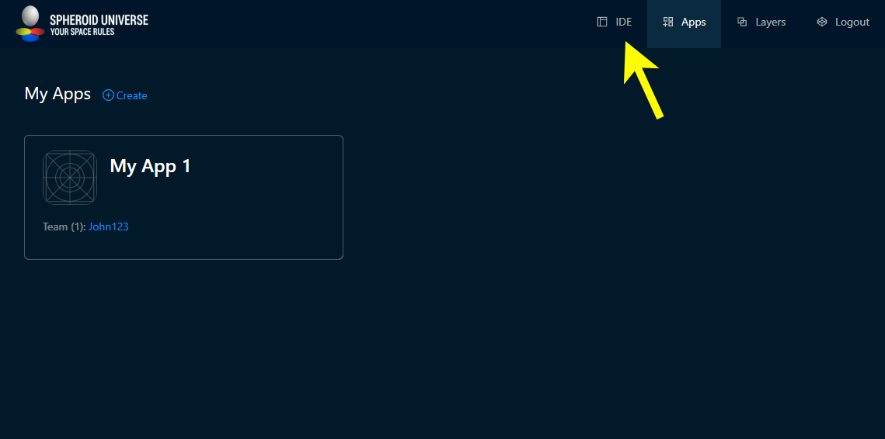

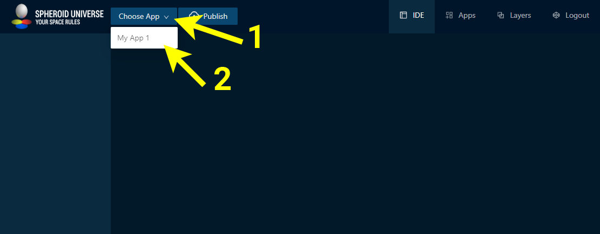

Create the "assets" folder: right-click the app name and select the "Create a folder" option, 
then, when the dialog comes up, enter "assets" and click "OK". 

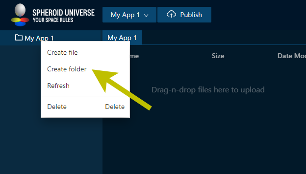


Repeat these steps for the "client" folder. 

For each folder, left-click the folder to expand it. 
The text "Drag-n-drop files here to upload" will appear on the right. 
Drag-n-drop the files with the source code from the corresponding folder on your local PC.

Then, left-click the root folder (with the same name as your app) 
to expand it and drag-n-drop the "app.json", "client.spheroid" and "server.spheroid" files.

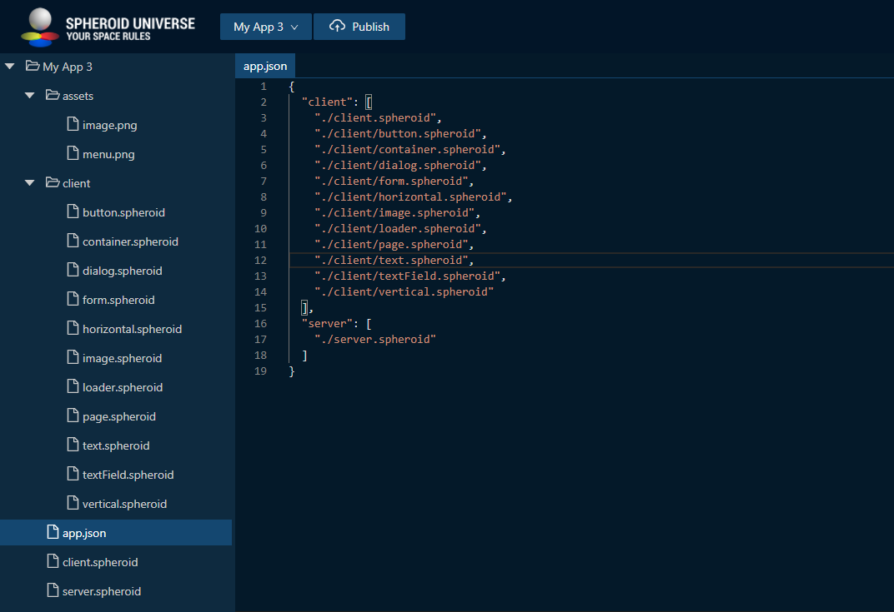

You're done! Now you can proceed to publishing the app.

## Publish your app

Click the "Publish" button in the top menu and, when the dialog comes up, 
keep the default settings, and click the "Publish" button at the right bottom of the dialog.


If the publication has been successful, you will see two info messages in the "Build" 
tab in the bottom pane. Congratulations, you have published your app!


If you don't see the two info messages, or you see error messages instead, 
check you've followed the previous steps accurately and, if so, 
[write us an issue](../../docs/submit-an-issue.md), and we will help you solve the problem.

## Launch your app on your mobile phone

Now as you have your app built and published, it's time to run it on your mobile phone.

Download the XR Hub Android mobile app either by 
[following the Google Play link](https://play.google.com/store/apps/details?id=io.spheroid.spheroidandroid) 
or by scanning the QR code:


| 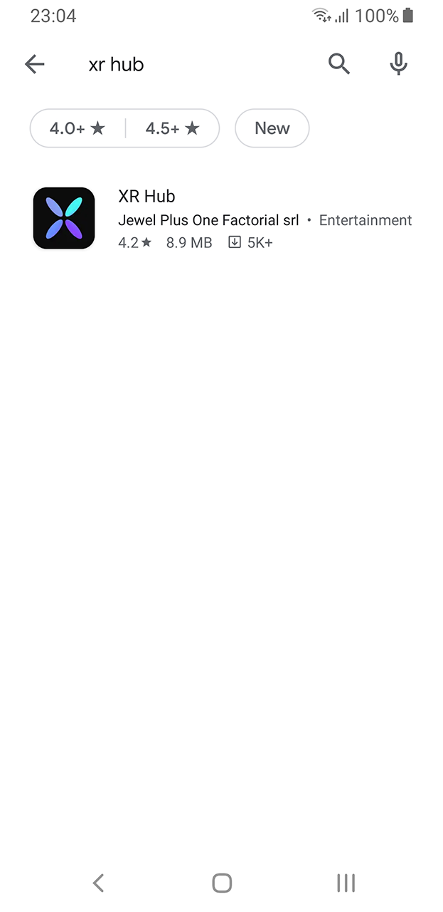 | 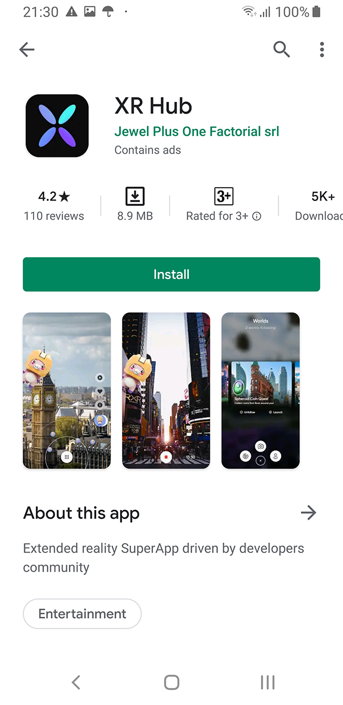 |  |  |
| --- | --- | --- | --- |
|  |  |  |  |

Currently, XR Hub works on the Android devices that [support ARCore](https://developers.google.com/ar/discover/supported-devices) 
only. iOS version of the app will be released soon.

Launch the XR Hub app on your phone.


|  |  |  |  |
| --- | --- | --- | --- |
|  |  |  |  |

Tap the menu button in the bottom center, then tap the account icon and 
log in to the app using the same email and password you used to register in the Platform.

|  |  | 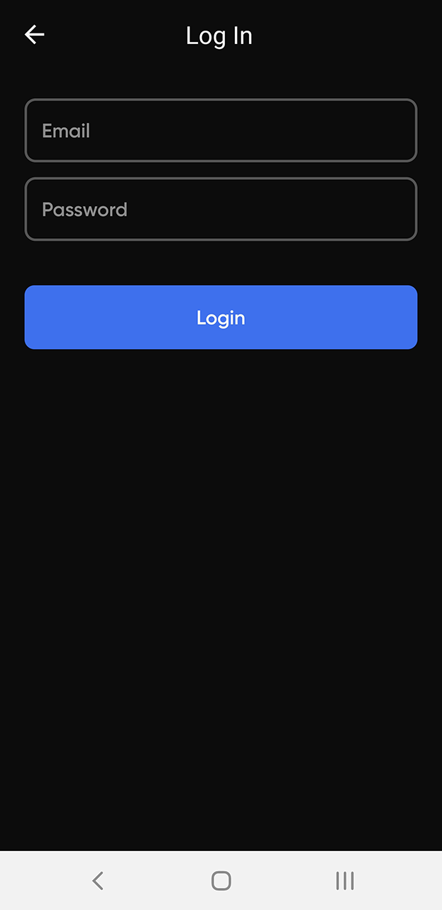 | 
| --- | --- | --- | --- |
|  |  |  |  |

When you're authorized, swipe right through the list of worlds to find the world your app 
has been published into (world is called "layer" in IDE). 
Note that if you're not logged in, you won't see the world, 
because the worlds created by developers are private. 
In the later tutorials you will learn how to add testers to your layer aka world.

| 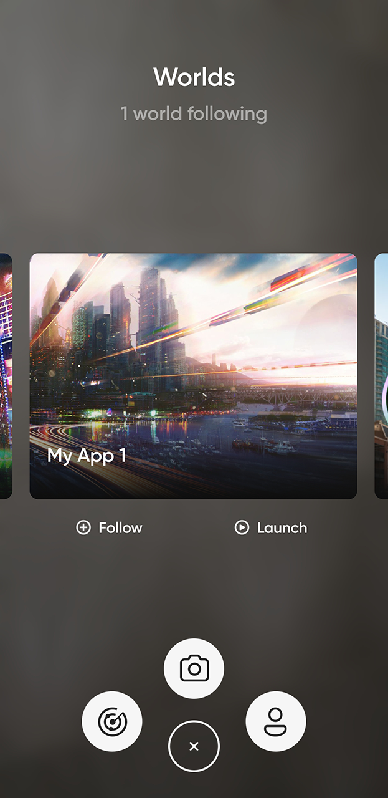 |  |  |  |
| --- | --- | --- | --- |
|  |  |  |  |

When you've found your world, tap the "Launch" button, and your app will run.

| 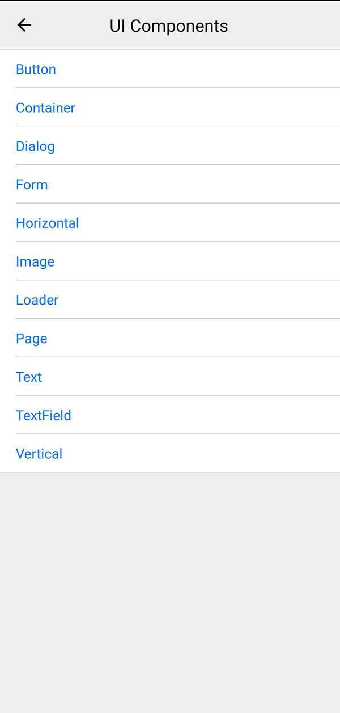 |  | 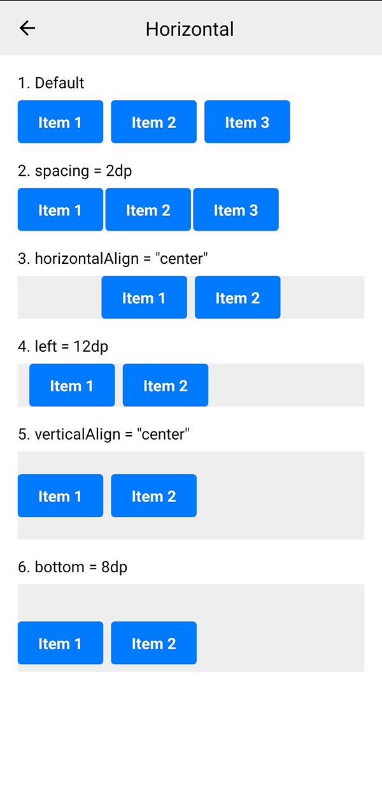 |  |
| --- | --- | --- | --- |
|  |  |  |  |

Congratulations, you have successfully run your app in the XR Hub! 

Now you can explore our documentation of [Spheroid Script UI Engine](https://spheroiduniverse.github.io/SpheroidScript/ui/),
try out some changes to the source code and see for yourself how the changes apply.

## Troubleshooting

If you have encountered any problems, please let us know by [submitting an issue](../../docs/submit-an-issue.md), we will make sure to help you find the solution. Please don't hesitate to contact us, as your issues and our replies will help to make our platform better and will be valuable to other developers.

## What's next?

- [More examples](..)
- [Spheroid Script Documentation](https://spheroiduniverse.github.io/SpheroidScript/)
- [Got a question? Submit an issue on GitHub](../../docs/submit-an-issue.md)
